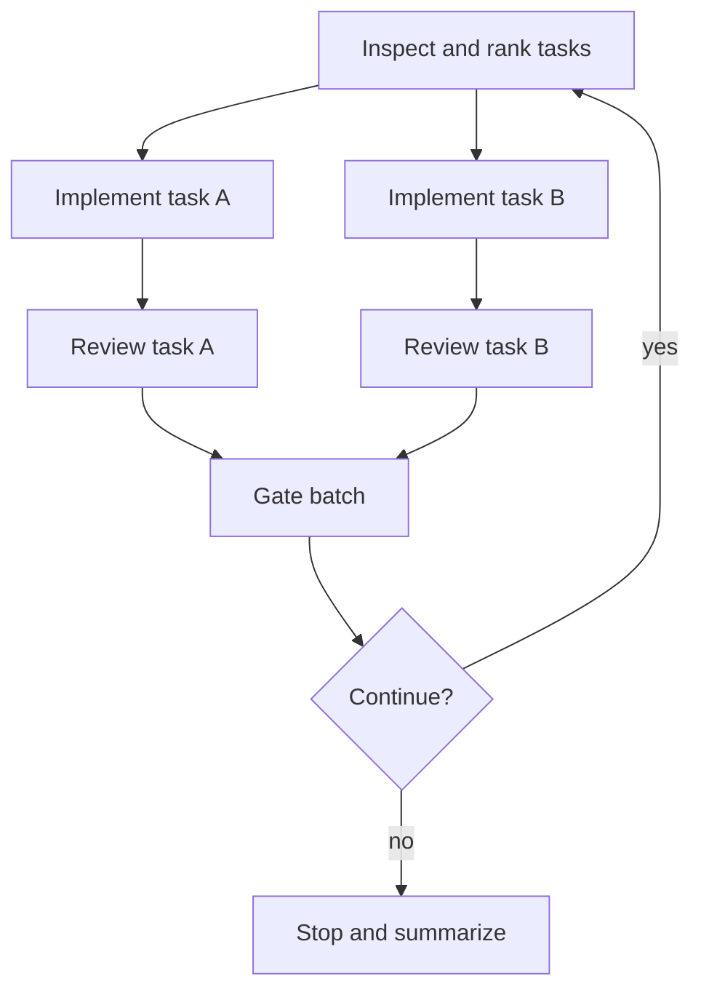
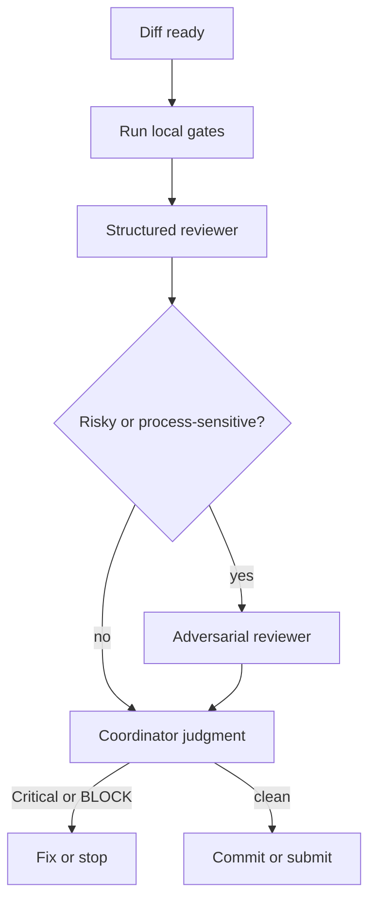
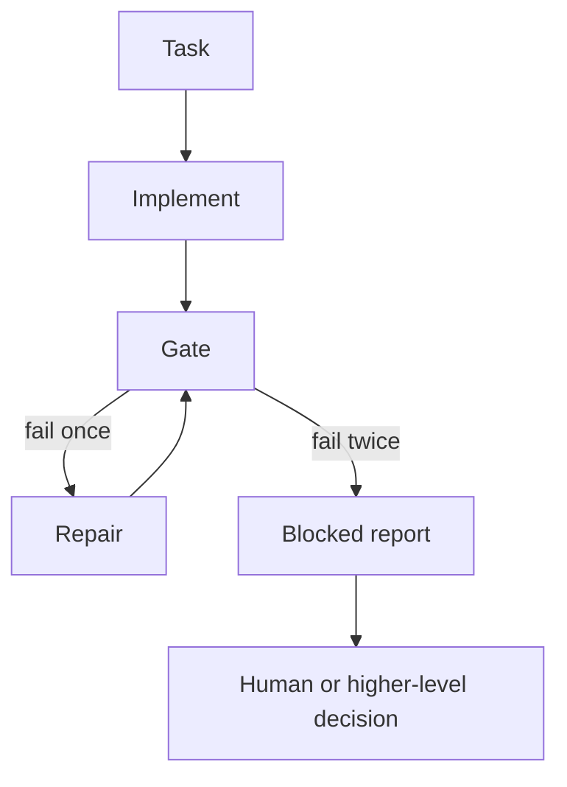

# Mermaid patterns

Use Mermaid to make task dependencies visible. Keep diagrams small enough to read. Put the DAG in the coordinator's visible progress update or swarm shared context before dispatching a wave.

## Improvement wave

## Review gate

## Dead-letter path

## Full improve loop with review failure loopback

Use `assets/swarm-improve-loop.mmd` as the default diagram for implementation waves. It shows: implement, gate, simplify, multi-review fanout, loopback on failure, commit on pass, and checkpoint before continuing.

## Checkpoint wave

Use `assets/checkpoint-wave.mmd` when a larger swarm reaches a milestone. At checkpoints, pause normal implementation, run refactor and extended tests, then decide whether to continue.
