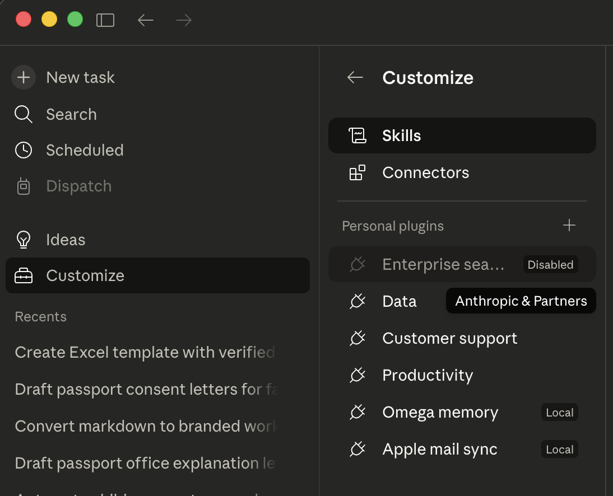
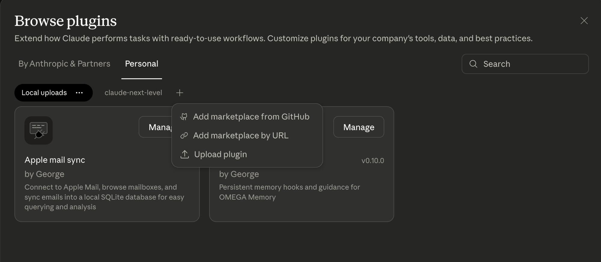
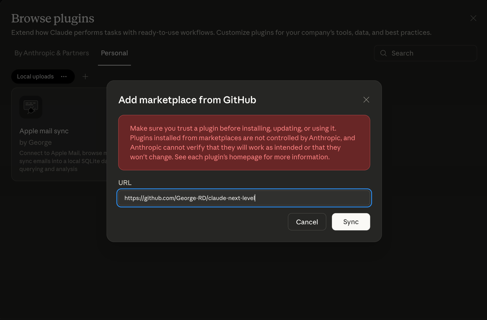
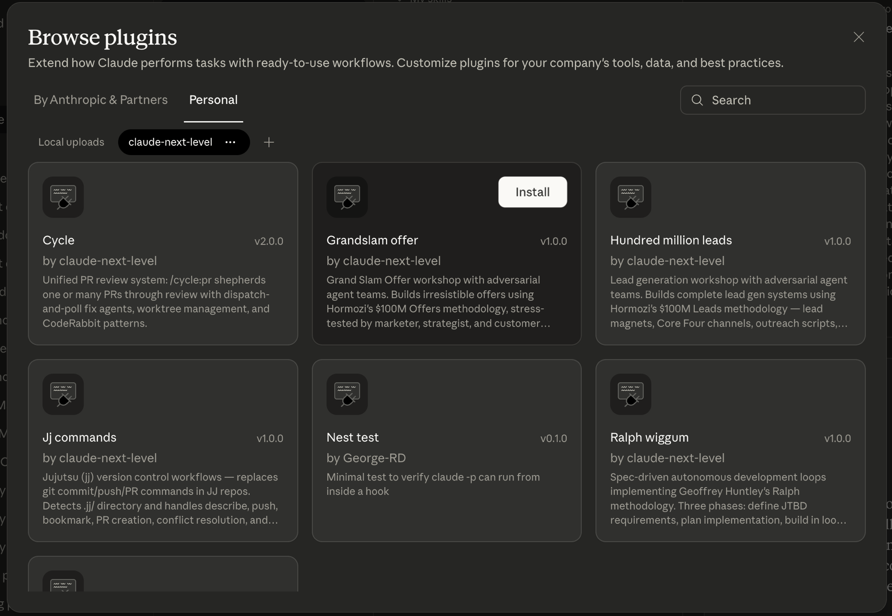
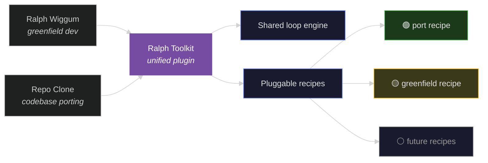

<picture>
  <source media="(prefers-color-scheme: dark)" srcset="https://capsule-render.vercel.app/api?type=waving&color=0:1a1a2e,100:16213e&height=200&section=header&text=claude-next-level&fontSize=42&fontColor=e0e0e0&animation=fadeIn&fontAlignY=35&desc=Plugins%20for%20Claude%20Code%20%26%20Cowork&descSize=16&descAlignY=55">
  
</picture>

<p align="center">
  
  
  
  
</p>

Business strategy workshops, PR automation, spec-driven development loops, and more — all as Claude Code plugins you can install in seconds.

---

## Plugins

### Business

| Plugin | Status | What it does |
|--------|--------|-------------|
| **Grandslam Offer** | Stable | Walks you through Alex Hormozi's *$100M Offers* methodology. Adversarial agent teams (marketer, strategist, customer personas) stress-test your offer at every step. You end up with a Grand Slam Offer — not a first draft. |
| **Hundred Million Leads** | Early | Same adversarial approach, applied to Hormozi's *$100M Leads*. Builds your lead magnet, Core Four channel strategy, outreach scripts, and Rule of 100 execution plan. Not fully road-tested yet — feedback welcome. |

### Development

| Plugin | Status | What it does |
|--------|--------|-------------|
| **Ralph Wiggum Toolkit** | Active | Recipe-based autonomous dev loops. **Greenfield recipe**: JTBD specs → plan → build for new features. **Port recipe**: extract behavioral specs from an existing codebase, port to a target language with citation-backed fidelity. Built on [Geoffrey Huntley's Ralph methodology](https://ghuntley.com/specs). Unified `/ralph` command namespace. |
| **Cycle** | Stable | PR review on autopilot. Point it at one or many PRs and it shepherds them through review — dispatches fix agents, manages worktrees, loops until clean, merges. |
| **Chief of Staff** | Stable | Meta-orchestrator. Coordinates concurrent workflows across plugins, manages agent waves, tracks session state. Short alias: `/cos`. |
| **Jj Commands** | Stable | Jujutsu (jj) version control workflows — if you use jj instead of git, this handles describe, push, bookmark, PR creation, and conflict resolution. |
| ~~Ralph Wiggum~~ | Deprecated | Replaced by Ralph Wiggum Toolkit (greenfield recipe). |
| ~~Repo Clone~~ | Deprecated | Replaced by Ralph Wiggum Toolkit (port recipe). |

---

## Install

Two paths depending on what you use.

### Claude Code (CLI)

1. Open Claude Code in your terminal
2. Type `/plugins`
3. Choose **Add marketplace from GitHub**
4. Enter: `https://github.com/George-RD/claude-next-level`
5. Pick the plugins you want

Done. Each plugin adds slash commands — type `/` to see what's available.

### Claude Cowork (desktop/web app)

**Step 1.** Click **Customize** in the sidebar, then click the **+** next to "Personal plugins".



**Step 2.** Select **Add marketplace from GitHub**.



**Step 3.** Paste the repo URL and click **Sync**:

```text
https://github.com/George-RD/claude-next-level
```



**Step 4.** You'll see all available plugins. Click **Install** on the ones you want.



---

## Using the Hormozi plugins

Once installed, just tell Claude what you need:

- *"I want to build an offer for my coaching business"* — Grandslam Offer takes over
- *"Help me figure out lead gen for my SaaS"* — Hundred Million Leads kicks in

Or use the slash commands directly: `/grandslam-offer`, `/hundred-million-leads`, or type `/` to browse.

The agent teams push back on weak ideas, ask hard questions, and force you to think through the value equation, pricing, guarantees, and bonuses properly. That's the point — you want the stress test before you go to market, not after.

---

## Roadmap



**What's happening now:**

- **Ralph Toolkit v1.0.0 shipped** — Repo Clone and Ralph Wiggum have been merged into a single plugin with a shared loop engine and pluggable recipes. The `port` recipe (from Repo Clone) and `greenfield` recipe (from Ralph Wiggum) both work through the unified `/ralph` command. The old plugins remain installable but are deprecated.

- **Hundred Million Leads** — Built but needs real-world testing. The Grandslam Offer plugin has been through several iterations; HML still needs the same treatment.

- **Grandslam Offer polish** — Working, but being refined with use. Expect tweaks to the workshop flow and agent prompts over time.

**Later:**

- More Ralph recipes (testing, migration, documentation generation)
- Cross-plugin coordination improvements via Chief of Staff
- Remove deprecated ralph-wiggum and repo-clone plugins (v2.0.0 timeline)

---

## Credits

The Ralph methodology comes from [Geoffrey Huntley](https://ghuntley.com/specs) — spec-driven development with autonomous agent loops. These plugins are an implementation of that approach for Claude Code.

The Hormozi plugins implement methodologies from Alex Hormozi's *$100M Offers* and *$100M Leads*.

## Contributing

Found a bug? Got an idea? [Open an issue](https://github.com/George-RD/claude-next-level/issues). PRs welcome.

This is an active project — things move fast and break sometimes. If something doesn't work, tell us.

<picture>
  
</picture>
